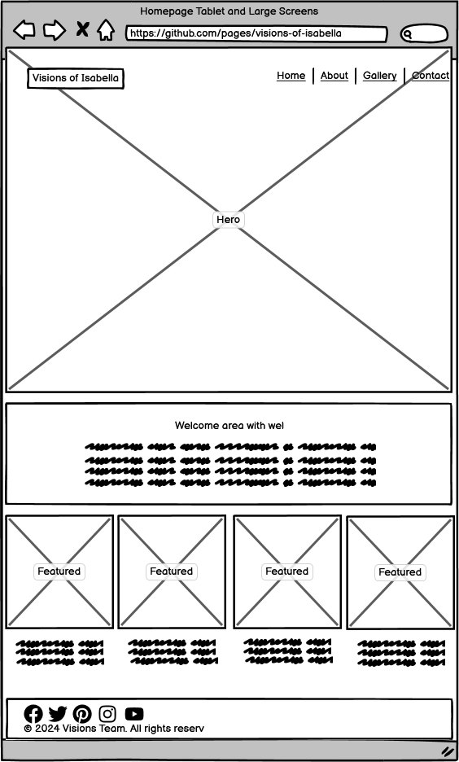
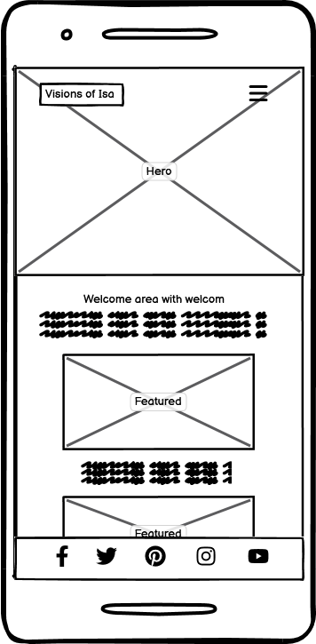

# Visions of Isabella

Welcome to **Visions of Isabella**, a digital art portfolio showcasing the unique and inspiring work of contemporary artist Isabella. This site is designed to highlight Isabella's artistic journey, featuring a diverse collection of her finest artworks. Visitors can explore various galleries, learn about the artist's philosophy, and contact Isabella for commissions or purchases.

## Table of Contents
- [UX Design (Wireframe)](#ux-design-wireframe)
- [User Stories](#user-stories)
- [Features](#features)
- [Testing](#testing)
- [Deployment](#deployment)
- [Credits/Technologies Used](#creditstechnologies-used)
- [Committers and Contributors](#creditstechnologies-used)

## UX Design (Wireframe)

### Homepage Wireframe

#### On Larger screens (Tablets, dektops and laptops)

#### On mobile

### Gallery Wireframe

### About Wireframe

### Contact Wireframe

## User Stories

### Homepage
- **User Story**: As a visitor, I can access the homepage where I can learn about the artist and view featured artworks, so that I can get an overview of the artist's style and recent work.

### About Page
- **User Story**: As a visitor, I can access the About page to learn more about the artist, Isabella, her background, and her artistic philosophy, so that I can understand the context and inspiration behind her work.

### Gallery
- **User Story**: As a visitor, I can access the gallery page to view a collection of the artist's artworks, categorized by medium or style, so that I can explore the artist's work in an organized and visually appealing manner.

### Contact Page
- **User Story**: As a visitor, I can access a contact page where I can send inquiries or requests to the artist, so that I can communicate directly with them for commissions or other purposes.

### Navbar
- **User Story**: As a user, I can navigate through different sections of the website using a navigation bar, so that I can easily access the gallery, about, and contact pages.

### Favicon
- **User Story**: As a visitor, I can see a favicon in the browser tab, so that I can easily identify and recognize the website among multiple open tabs.

### Footer
- **User Story**: As a visitor, I can access the footer on every page of the website to find copyright information, social media links, and additional navigation options, so that I can easily access important information and navigate the site.

## Features

- **Gallery Section**: A curated collection of Isabella's artwork, categorized by medium and style.

- **About the Artist**: Learn about Isabella, her background, and her artistic philosophy.

- **Contact Information**: Reach out to Isabella for inquiries, commissions, or purchases.

- **Responsive Design**: The site is optimized for viewing on all devices, ensuring a seamless experience for all users.

- **Favicon**: A recognizable icon that appears in the browser tab, enhancing brand identity.

- **Social Links Hover Effects**: Interactive hover effects on social media links for better user engagement.

## Credits/Technologies Used

- **HTML5**: For structuring the content on the web.
- **CSS3**: For styling the website.
- **almostreal.me**: For project idea inspiration.
- **Optimizilla**: For image optimization.
- **Love Running Project**: For inspiration on toggle navigation menu on mobile.
- **Git & GitHub**: For version control and hosting the project.
- **Canva**: For creating and optimizing images and graphics.
- **Chatgpt AI**: For images.
- **Google Fonts**: For typography.
- **Foowebs**: For modal design.
- **Mark Brisco - Code Institute**: For guidance on git and gitpod terminal.
- **Amy Richardson - Code Institute**: General guidance.

## Committers and Contributors
- **Henry Ofodieze** (Team Lead)
- **Florin Niculcea**
- **Charles Mould**